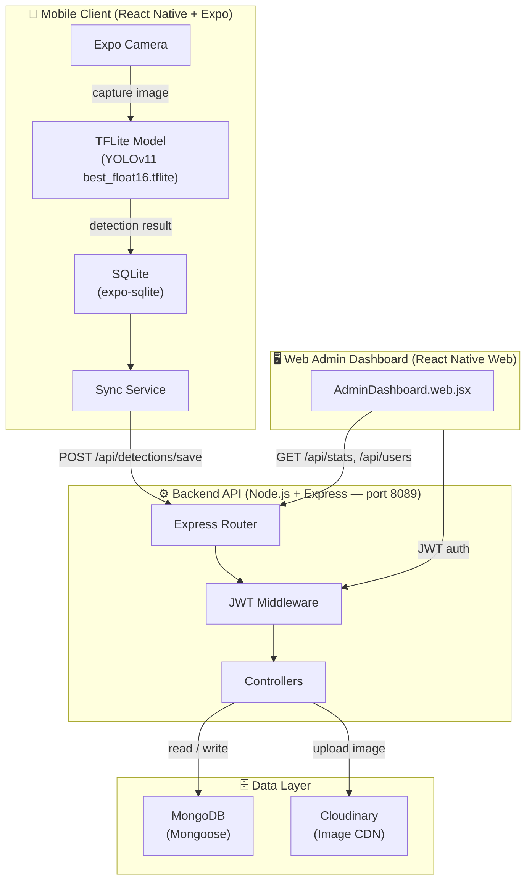

DEC follows a **three-tier architecture**: a stateless REST API backend, a cross-platform mobile/web client, and a web-only admin dashboard that shares the same client codebase. The mobile client is intentionally designed to be **offline-first** — the TensorFlow Lite model runs fully on-device and all detection results are written to a local SQLite database before being synchronized asynchronously with the MongoDB backend. The admin dashboard communicates exclusively with the REST API and never interacts with client-local storage.

## Architecture Diagram

## Components

<CardGroup cols={2}>
  <Card title="Backend API" icon="server" href="/quickstart#step-2-configure-the-backend">
    An **Express v5** server (`backend/server.js`) running on port **8089**, written as ESM modules. It exposes REST endpoints under `/api/` for authentication, detections, pathologies, users, statistics, notifications, treatments, messages, password recovery, and admin operations. MongoDB is accessed through **Mongoose v9** schemas. All protected routes are guarded by a JWT middleware that validates `Authorization: Bearer <token>` headers. Images are uploaded to **Cloudinary** via Multer middleware before the detection record is persisted.
  </Card>
  <Card title="Mobile Client" icon="mobile-screen-button" href="/quickstart#step-4-open-on-your-platform">
    A **React Native 0.83 + Expo SDK 55** application. State is managed via **Context API** (auth context stores the JWT and user profile). Navigation is stack-based using **React Navigation v7**. On mobile, JWT tokens are stored securely in **Expo SecureStore**; on web, `sessionStorage` is used. The `axios` HTTP client includes request interceptors that attach the token to every outbound request and response interceptors that clear the session on `401` responses.
  </Card>
  <Card title="Admin Dashboard" icon="gauge-high" href="/introduction#what-dec-does">
    Web-only screens (`LandingPage.web.jsx`, `AdminDashboard.web.jsx`, `LoginAdmin.web.jsx`) rendered via **react-native-web**. The dashboard consumes `/api/stats/kpis`, `/api/stats/incidence`, and `/api/stats/map` to render KPI counters, incidence trend charts (built with **Recharts**), and an interactive heat map (built with **React Leaflet**). Administrators can manage users, view detection logs, and export data as ZIP archives via `/api/admin/export/start`.
  </Card>
  <Card title="Data Layer" icon="database" href="/architecture#key-dependencies">
    **SQLite** (`expo-sqlite`) serves as the local-first store on the device, written immediately after each detection so results are available offline. A background sync service reads un-synced records and pushes them to the **MongoDB** backend via the REST API. **MongoDB** (accessed through Mongoose) is the single source of truth for the admin dashboard and cross-device history. Detection images are stored on **Cloudinary** and referenced by URL in both SQLite and MongoDB documents.
  </Card>
</CardGroup>

## Request Flow

The following steps trace a complete detection event from user interaction to admin visibility:

<Steps>
  <Step title="User authenticates">
    The user opens DEC and signs in via **email/password**, **Google OAuth** (`@react-native-google-signin/google-signin`), or **Facebook** (`react-native-fbsdk-next`). The backend verifies credentials — Google tokens are validated with `google-auth-library`, passwords are compared with `bcryptjs`. On success, the API returns a **JWT** which the client stores in `expo-secure-store` (mobile) or `sessionStorage` (web). All subsequent requests include this token in the `Authorization` header via the `axios` request interceptor in `src/api/api.js`.
  </Step>
  <Step title="User captures an image">
    The user taps the camera button on `CameraScreen.jsx`. **Expo Camera** opens the live viewfinder. When the user takes the photo, `expo-image-manipulator` resizes and normalizes the image to match the TFLite model's expected input tensor dimensions.
  </Step>
  <Step title="On-device TFLite inference">
    The pre-processed image tensor is passed to the **YOLOv11** model compiled as `best_float16.tflite` and loaded by **`react-native-fast-tflite`**. Inference runs entirely on the device CPU/GPU — no network request is made. The model returns bounding boxes, class labels (disease names), and confidence scores. The highest-confidence detection is resolved to a full `Pathology` record (name, description, symptoms, treatment, prevention tips).
  </Step>
  <Step title="Result saved to SQLite">
    The detection result — including the pathology ID, confidence score, severity, and a local image URI — is written to the device's **SQLite** database via `expo-sqlite`. This guarantees the result is immediately accessible in the history screen even if the device is offline. The record is flagged as `synced: false`.
  </Step>
  <Step title="Result synced to MongoDB">
    When a network connection is available, the sync service reads all `synced: false` records from SQLite, uploads the image to **Cloudinary** (returning a permanent CDN URL), and sends a `POST /api/detections/save` request to the backend. The backend controller persists the detection document to **MongoDB** and returns the assigned `_id`. SQLite marks the record as `synced: true` and stores the remote `_id` for future reference.
  </Step>
  <Step title="Visible in admin dashboard">
    The detection is now queryable by the admin panel. The dashboard calls `/api/stats/kpis` and `/api/stats/incidence` to refresh counters and trend charts. Individual records appear in the user management view, and the geographic coordinates (captured via `expo-location`) are rendered as heat-map points via **React Leaflet**. Administrators can drill into any detection, view the Cloudinary-hosted image, and export the full history as a ZIP archive.
  </Step>
</Steps>

## Key Dependencies

| Package | Version | Layer | Role |
|---|---|---|---|
| `express` | ^5.2.1 | Backend | HTTP server, routing, and middleware pipeline |
| `mongoose` | ^9.1.6 | Backend | MongoDB ODM — schemas for User, Detection, Pathology, Notification |
| `jsonwebtoken` | ^9.0.3 | Backend | JWT signing and verification for protected routes |
| `bcryptjs` | ^3.0.3 | Backend | Secure password hashing at registration and comparison at login |
| `cloudinary` | ^2.9.0 | Backend | Detection image upload, transformation, and CDN delivery |
| `multer` | ^2.1.1 | Backend | Multipart/form-data parsing for image upload endpoints |
| `nodemailer` | ^8.0.3 | Backend | Transactional email for password recovery flows |
| `google-auth-library` | ^10.6.2 | Backend | Server-side Google OAuth ID token verification |
| `archiver` | ^7.0.1 | Backend | Streaming ZIP archive generation for data export |
| `react-native-fast-tflite` | ^2.0.0 | Frontend | On-device TensorFlow Lite model execution (YOLOv11) |
| `expo-camera` | ~55.0.15 | Frontend | Unified camera capture API across iOS, Android, and Web |
| `expo-sqlite` | ~55.0.15 | Frontend | Local relational database for offline-first detection storage |
| `expo-secure-store` | ~55.0.13 | Frontend | Encrypted key-value store for JWT persistence on mobile |
| `expo-image-manipulator` | ~55.0.15 | Frontend | Image resize and format normalization before TFLite inference |
| `expo-location` | ~55.1.8 | Frontend | GPS coordinates captured alongside each detection |
| `axios` | ^1.13.5 | Frontend | HTTP client with auth token interceptors and timeout handling |
| `@react-navigation/stack` | ^7.8.2 | Frontend | Stack-based screen navigation for the mobile app |
| `recharts` | ^3.8.1 | Web Admin | Incidence trend charts and KPI visualizations |
| `react-leaflet` | ^4.2.1 | Web Admin | Interactive geographic heat map of detection locations |
